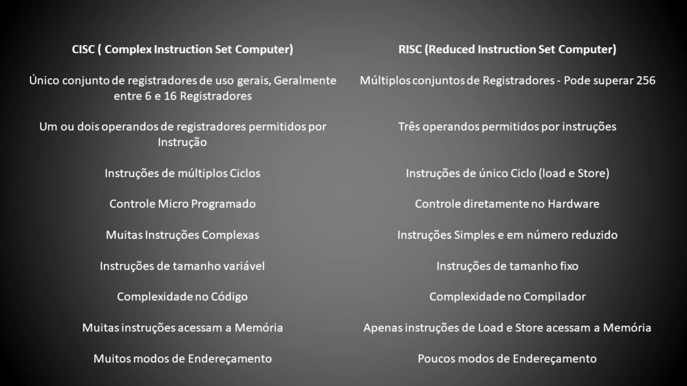

# Arquitetura e Organização de Computadores > Processadores
 

Prof. Eduardo Ono

 

## Conceitos

> ISA (Arquitetura do Conjunto de Instruções)

> Arquiteturas RISC e CISC

 

## Vídeos recomendados

[[Calc Ulando]](https://www.youtube.com/channel/UCVfDIptyOxKOLT7kqzbg0uA) [Fetch Decode Execute CYCLE ANIMATION](https://www.youtube.com/watch?v=04UGopESS6A) (YouTube, 2:24)

 

## Fundamentos

* [CrashCourse] How Computers Calculate - the ALU: Crash Course Computer Science #5 | [YouTube](https://youtu.be/1I5ZMmrOfnA) (11:09)

 

## Arquiteturas RISC e CISC

> ### História
> * [Rodrigo Baltar] [Processadores - História das Arquiteturas CISC e RISC](https://www.youtube.com/watch?v=1moRiz7KUD4) (YouTube, 18:29, Nov/2017)

> ### Diferenças entre as arquiteturas RISC e CISC
> 

> ### ARM vs x86
> * [Rodrigo Baltar] [Processadores - ARM vs X86](https://www.youtube.com/watch?v=PUWQBVtbj6Y) (YouTube, 14:28, Nov/2017)

 

## Intel Core
 

## AMD Ryzen
 

OBS.: A tabela não contempla os modelos PRO.

| Zen (2017)           | Zen+ (2018)          | Zen 2 (2019)          | Zen 3 (2020)          |
| ---                  | ---                  | ---                   | ---                   |
| 14 nm                | 12 nm                | 7nm                   | 7nm                   |
| ---                  | ---                  | ---                   |                       |
| Ryzen 3 1200  (4/4)  | Ryzen 3 1200AF (4/4) | Ryzen 3 3100    (4/8) |                       |
| Ryzen 3 1300X (4/4)  | Ryzen 3 2300X        | Ryzen 3 3300X         |                       |
| Ryzen 5 1400  (4/8)  | ---                  |                       |                       |
| ---                  | ---                  | Ryzen 5 3500          |                       |
| Ryzen 5 1500X        | Ryzen 5 2500X (4/8)  | Ryzen 5 3500X         |                       |
| Ryzen 5 1600  (6/12) | Ryzen 5 2600  (6/12) | Ryzen 5 3600  (6/12)  |                       |
| Ryzen 5 1600X        | Ryzen 5 2600X        | Ryzen 5 3600X/XT      | Ryzen 5 5600X  (6/12) |
| Ryzen 7 1700  (8/16) | Ryzen 7 2700  (8/16) | ---                   |                       |
| Ryzen 1700X          | Ryzen 7 2700X        | Ryzen 7 3700X (8/16)  |                       |
| Ryzen 1800X          | ---                  | Ryzen 7 3800X/XT      | Ryzen 7 5800X  (8/16) |
|                      | ---                  | Ryzen 9 3900  (12/24) |                       |
|                      |                      | Ryzen 9 3900X/XT      | Ryzen 9 5900X (12/24) |
|                      |                      | Ryzen 9 3950X (16/32) | Ryzen 9 5950X (16/32) |
| **APUs** (2018)      | **APUs** (2019)      | **APUs** (2020)       |                       |
| Ryzen 3 2200G (4/4)  | Ryzen 3 3200G  (4/4) | Ryzen 3 4300G  (4/8)  |                       |
| Ryzen 5 2400G (4/8)  | Ryzen 5 3400G  (4/8) | Ryzen 5 4600G  (6/12) |                       |
|                      |                      | Ryzen 7 4700G  (8/16) |                       |
| **Mobile** (2018)    | **Mobile** (2019)    | **Mobile** (2020)     |                       |
| Ryzen 3 2200U (2/4)  | ---                  |                       |                       |
| Ryzen 3 2300U (4/4)  | Ryzen 3 3300U  (4/4) | Ryzen 3 4300U  (4/4)  |                       |
| Ryzen 5 2500U (4/8)  | Ryzen 5 3500U  (4/8) | Ryzen 5 4500U  (6/6)  |                       |
|                      |                      | Ryzen 5 4600U  (6/12) |                       |
| Ryzen 5 2600H        | Ryzen 5 3550H        | Ryzen 5 4600HS/H      |                       |
| Ryzen 7 2700U        | Ryzen 7 3700U        | Ryzen 7 4700U  (8/8)  |                       |
|                      |                      | Ryzen 7 4800U  (8/16) |                       |
| Ryzen 7 2800H        | Ryzen 7 3750H        | Ryzen 7 4800HS/H      |                       |
|                      | Ryzen 7 3780U        | Ryzen 9 4900HS/H      |                       |
